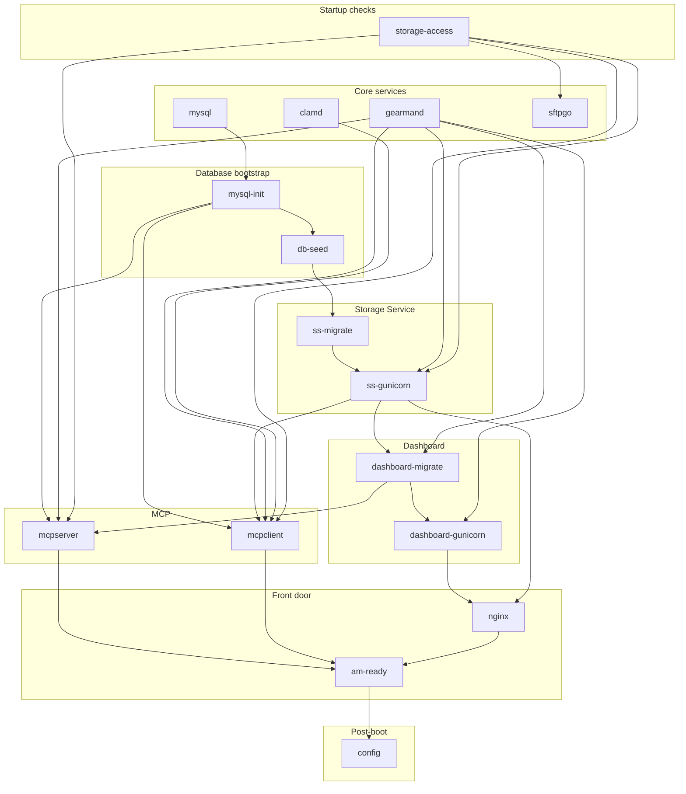
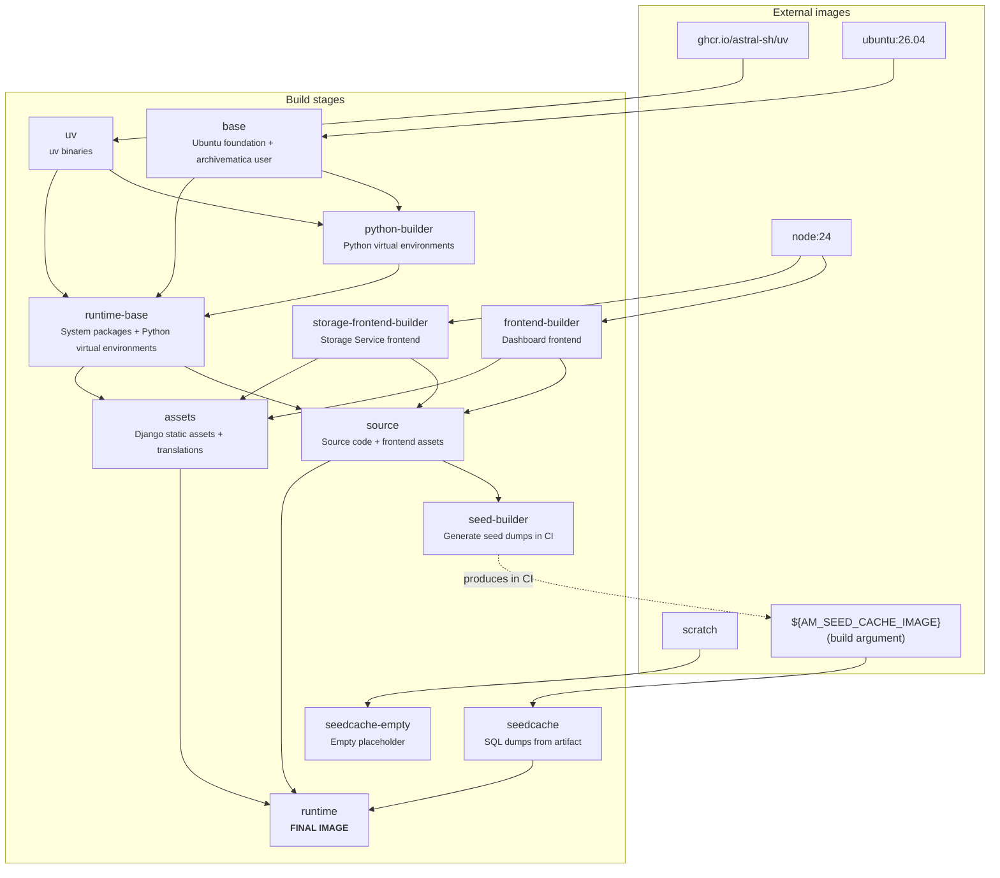

# Contributing to ambox

This guide contains development and implementation details for contributors
working on the single-container ambox distribution.

## Development

Build a local seed cache image, then build and run the image locally:

    make seed-cache-local
    make run

`make build` provisions the `DemoTransferCSV` and `Images` sample transfers
from the sampledata revision pinned by this repository. It uses a filtered,
sparse checkout when the submodule is not already initialized. `make verify`
uses the same provisioner but requests only the `Images/pictures` directory.

The local `Makefile` defaults to `SEED_CACHE_IMAGE=ambox-build-cache-local`, so
`make seed-cache-local`, `make build`, and `make run` use the same seed cache
repo automatically. `make seed-cache-local` first tries to reuse a matching
remote seed cache tag and falls back to building the seed locally if none
exists. Re-run it after migration, seed script, or Dockerfile changes. The cache
key includes all three so database build environment changes get fresh dumps.

The bundled `hack/box/Makefile` mounts `test/ambox.yaml` and the SFTP test
keys under `test/` to simplify local development. Adjust those mounts if you
want different config or key paths.

Run `make verify` to build the image and process a bundled sample transfer into
an AIP and a DIP. The test starts ambox with fresh volumes mounted at the SFTP
upload directory and default AIP and DIP storage locations, uploads the sample
through SFTP, and checks that the stored AIP and DIP are readable from their
mounted locations. The pytest-bdd scenario also checks that jobs and tasks were
created and uses Playwright with Chromium to verify the transfer, virus scan,
and ingest results in Dashboard. A separate bootstrap scenario lists Storage
Service pipelines, spaces, locations, and packages through the API, checks that
the registered pipeline matches Dashboard's `X-Archivematica-ID` response
header, and verifies the configuration in the Storage Service UI. After ingest,
the test checks that both packages are listed by the API under that pipeline
and displayed in the Storage Service package table. These browser checks catch
missing or broken frontend assets even when the APIs still work.
`make verify` installs the matching Chromium build automatically. Set
`AMBOX_SKIP_BUILD=1` to verify an existing `IMAGE:TAG`. On CI failures, browser
traces and screenshots, recent API responses, and container logs are uploaded
as artifacts. Pull requests run this end-to-end test in CI. Releases test the
amd64 candidate digest before publishing version manifests. Stable releases
also update `latest`; prereleases leave it unchanged.

The release workflow defaults to a notes-only preview. It uses Copilot to
summarize the upstream Archivematica and ambox commit ranges, falling back to
deterministic commit lists when Copilot is unavailable. The generated Markdown
is shown in the job summary and uploaded as a workflow artifact. Previewing
does not build or publish images, push a tag, or create a GitHub Release:

    gh workflow run release.yml -f version=1.0.14

To compare generated notes with an existing release, preview its version. The
workflow automatically uses the matching existing tag as its target:

    gh workflow run release.yml -f version=1.0.13

The optional `target` input can preview a different historical tag or commit.

After reviewing a preview, run the workflow with publishing enabled to build
and test the images, publish the manifests, push the tag, and create the
GitHub Release:

    gh workflow run release.yml --ref dev/ambox -f version=1.2.0 -f publish=true

A version with a SemVer prerelease suffix, such as `1.2.0-rc.1`, publishes only
its versioned image manifests and is marked as a GitHub prerelease. It does
not move `latest` in either registry. The workflow derives this automatically
from the version; no separate prerelease flag is needed. Keep changes to this
publication policy in a separate commit from upstream synchronization.

For a release candidate, preview its automatically generated notes first:

    gh workflow run release.yml --ref dev/ambox -f version=1.2.0-rc.1

After review, publishing is a separate, explicitly authorized action:

    gh workflow run release.yml --ref dev/ambox -f version=1.2.0-rc.1 -f publish=true

## Upstream synchronization

Start a fresh sync branch from updated `origin/dev/ambox`, fetch upstream
`qa/1.x` and the relevant release tags, and compare their SHAs. A release
candidate tag may exist without a GitHub Release page. If QA has moved beyond
the requested tag, record the additional changes in the merge commit.

Merge with `--no-ff` and the subject `Merge Archivematica qa/1.x`. Record the
upstream SHA, Archivematica and Storage Service tag SHAs, and conflict decisions
in the body. Initialize Storage Service at the merged submodule revision and
verify that it matches the intended release; do not update it to an unrelated
branch tip.

Preserve ambox image verification, release workflows, and the fork's dependency
update scope. Keep upstream image publishing and authentication integration CI
disabled, including workflows that upstream renames or replaces. Adapt the
single-container Dockerfile to upstream build conventions, including both
frontend builds, while preserving s6 supervision and ambox configuration.
Check package availability when updating Ubuntu and review seed compatibility.
Dockerfile changes select a fresh seed key; `make seed-cache-local` builds it
locally without publishing it. Service graph changes belong in this guide.

Use the existing `make verify` scenario and PR CI as the integration gate.
Record any deferred manual verification in the handoff. Once publication is
explicitly authorized, open a PR against `dev/ambox`; merge it only after review
and passing checks, using a merge commit, never squash or rebase. Local-only
work stops at local commits: no push, PR creation, workflow dispatch, or cache
publication.

Release notes are generated automatically, including during publication; no
handwritten release-notes file is required for a sync. Review the generated
preview for the intended versions and compatibility changes. Its inputs cover
Archivematica and fork commit ranges, but do not expand Storage Service's
submodule history. A preview is not an image build or a runtime check. Dispatch
from the intended release ref using `--ref`; `target` only changes the notes
preview and cannot select a different commit for publishing.

## Runtime service dependencies

ambox uses [s6-overlay] to supervise Archivematica services in one container.
Each service is managed as an s6 service; its definition and dependencies are
in `s6-rc.d`. The graph below is derived from `s6-rc.d/*/dependencies`; arrows
point from prerequisite to dependent.

| Service | Depends on |
| --- | --- |
| `mysql` | (none) |
| `gearmand` | (none) |
| `clamd` | (none) |
| `storage-access` | (none) |
| `sftpgo` | `storage-access` |
| `mysql-init` | `mysql` |
| `db-seed` | `mysql-init` |
| `ss-migrate` | `db-seed` |
| `ss-gunicorn` | `ss-migrate`, `gearmand`, `storage-access` |
| `dashboard-migrate` | `ss-gunicorn`, `gearmand` |
| `dashboard-gunicorn` | `dashboard-migrate`, `gearmand` |
| `mcpserver` | `mysql-init`, `gearmand`, `dashboard-migrate`, `storage-access` |
| `mcpclient` | `mysql-init`, `gearmand`, `ss-gunicorn`, `clamd`, `storage-access` |
| `nginx` | `dashboard-gunicorn`, `ss-gunicorn` |
| `am-ready` | `mcpserver`, `mcpclient`, `nginx` |
| `config` | `am-ready` |

## Dockerfile build stages

The build follows upstream Ubuntu, uv (including its image digest), Node, and
MediaArea defaults. Each Python environment uses its project `.python-version`;
`PYTHON_VERSION` is an optional build argument override. Both frontend builds
use upstream npm configuration before installing locked dependencies.

The `Dockerfile` uses a multi-stage build to construct the final runtime image.

| Stage | Depends on | Purpose |
| --- | --- | --- |
| `uv` | `ghcr.io/astral-sh/uv` | Provides uv binaries for Python management |
| `base` | `ubuntu:26.04` | Foundation with locale setup and the `archivematica` user |
| `python-builder` | `base`, `uv` | Builds Python virtual environments for Archivematica and Storage Service |
| `frontend-builder` | `node:24` | Compiles Dashboard frontend assets |
| `storage-frontend-builder` | `node:24` | Compiles Storage Service frontend assets |
| `seedcache-empty` | `scratch` | Empty placeholder stage for development and testing |
| `seedcache` | `${AM_SEED_CACHE_IMAGE}` | Provides SQL database dumps from an external artifact |
| `runtime-base` | `base`, `uv`, `python-builder` | Runtime system packages and Python virtual environments |
| `source` | `runtime-base`, `frontend-builder`, `storage-frontend-builder` | Adds source code and compiled frontend assets |
| `assets` | `runtime-base`, `frontend-builder`, `storage-frontend-builder` | Generates Django static assets and translations |
| `seed-builder` | `source` | Generates seed dumps for CI |
| `runtime` | `source`, `seedcache`, `assets` | Final distributable image |

The `runtime` stage is tagged and published. `seed-builder` produces the seed
cache artifact in CI, which is pushed to GHCR. Later builds consume it through
the `AM_SEED_CACHE_IMAGE` build argument rather than directly from that stage.

[s6-overlay]: https://github.com/just-containers/s6-overlay
