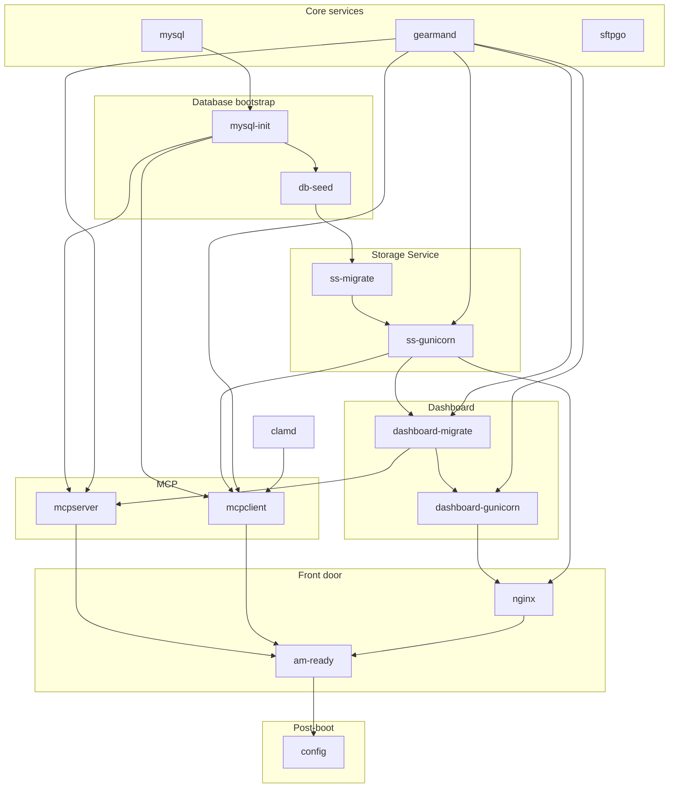
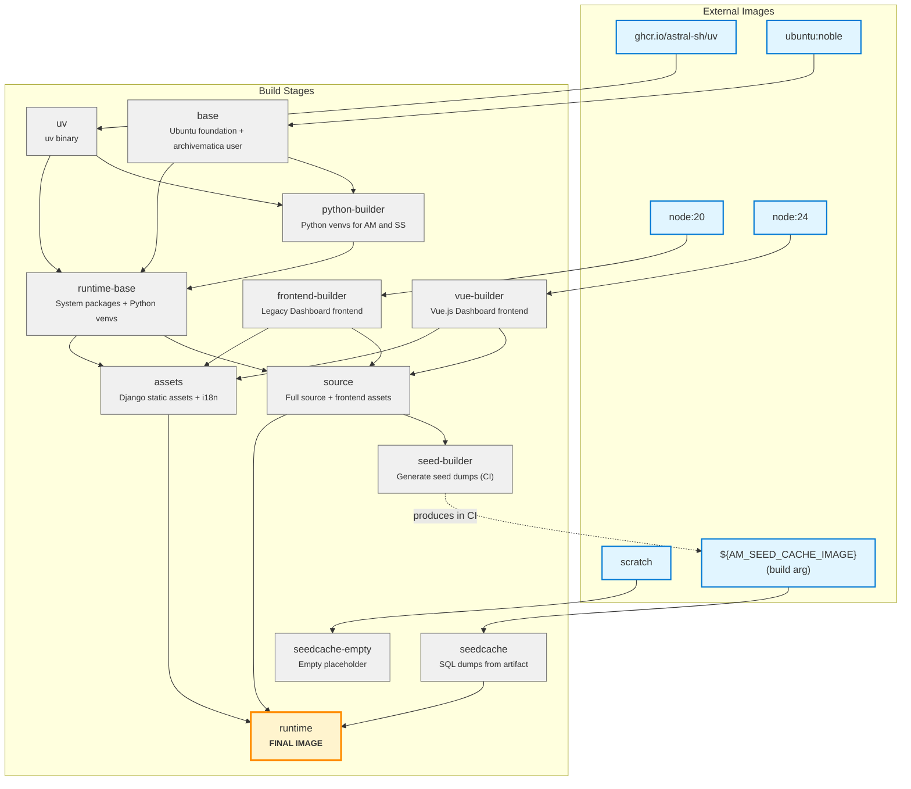

# ambox

The goal of **ambox** is a one-liner style deployment for local testing and
development (or lightweight use cases), where Archivematica runs as a single,
self-contained Linux container environment. It also provides some
configurability via its [config file], letting you customize processing
configuration details and more.

There are potential improvements still to do, such as more configurability,
integration with remote storage services, and similar enhancements. A full
list of ideas is maintained in the [wiki].

[config file]: #configuration-schema
[wiki]: https://github.com/sevein/ambox/wiki

## Quick start

Run the image and publish the dashboard on port `8080`:

    docker run --rm -p 8080:64080 ghcr.io/sevein/ambox:latest

Then open <http://localhost:8080/> in your browser. You're ready to go!

## Usage

Nginx is the front door for the monolith image and exposes two entrypoints:

- `:64080` → Archivematica Dashboard
- `:64081` → Archivematica Storage Service

Additionally, SFTPGo runs an SFTP service on port `64022`. The default SFTP user
is `archivematica` with password `12345`. Use this service to upload your
transfer packages.

### Production-like configuration

> [!WARNING]
> When publishing ports, make sure your host firewall rules actually apply to
> Docker-forwarded traffic, and prefer binding to `127.0.0.1` unless you intend
> to expose the service.

To run the container as a long-lived service with some resource limits and
log rotation, use the following `docker run` command:

```
docker run \
  # Run as a long-lived service
  --detach \
  # Stable container name
  --name ambox \
  # Restart on crash or daemon restart
  --restart unless-stopped \
  # Expose the Dashboard
  --publish 127.0.0.1:64080:64080 \
  # Expose the Storage Service
  --publish 127.0.0.1:64081:64081 \
  # Expose the SFTP service
  --publish 127.0.0.1:64022:64022 \
  # Limit memory
  --memory 8g \
  # Limit CPU
  --cpus 2.0 \
  # Rotate logs to avoid disk exhaustion
  --log-opt max-size=10m \
  # Keep a limited number of log files
  --log-opt max-file=5 \
    ghcr.io/sevein/ambox:test
```

Now with this setup, you can perform a variety of operations, e.g.:

```
docker ps -a --filter name=ambox   # View the container status.
docker logs ambox                  # View the container logs.
docker stop ambox                  # Stop the container.
docker start ambox                 # Start the container.
docker restart ambox               # Restart the container.
docker exec ambox ss -lntup        # View listening services inside the container.
docker exec ambox ps -ef --forest  # View the process tree inside the container.
docker rm ambox                    # Remove the container (only when stopped).
```

You can also mount host directories as volumes to persist data.

### Uploading a transfer via SFTP from the terminal

Connect from your host (macOS/Linux) using OpenSSH `sftp` client:

    # When prompted, enter the password "12345".
    sftp -P 64022 archivematica@localhost

Useful interactive commands once connected:

    pwd
    put -r /path/to/transfer

## Configuration schema

At boot, ambox reads a config document from `/etc/ambox/config.yaml`, falling
back to the bundled default in [`config/ambox.yaml`](config/ambox.yaml).
The document can populate processing configurations and optional SFTPGo
settings. The JSON Schema is in [`config/schema.json`]. You can override the
config path with `AMBOX_CONFIG_FILE`.

Example config that extends the bundled defaults, adds an automated override,
and defines a full "demo" configuration:

```yaml
version: v1
processing:
  configs:
    - name: automated
      extends: automated
      config:
        virus_scanning: false
    - name: demo
      extends: default
      config:
        virus_scanning: false
        bind_pids: true
```

To pin a static SFTP host key, provide the path to a private key file that is
readable by the `archivematica` user inside the container. The file must exist
at container start, or the SFTP service will fail to boot.

```yaml
version: v1
sftpgo:
  host_key: /etc/ambox/sftpgo_host_key
```

[`config/ambox.yaml`]: config/ambox.yaml
[`config/schema.json`]: config/schema.json

## How it works

This image uses the s6-overlay init system to supervise all core Archivematica
services inside a single container. Each service (database, dashboard, storage,
etc.) is managed as an s6 service, with dependencies and startup order defined
in `s6-rc.d`.

[s6-overlay]: https://github.com/just-containers/s6-overlay

### Trade-offs

Compared to the standard (officially supported) approach, this image prioritizes
simplicity and portability over composability:

- Not all ecosystem services are included (e.g. Elasticsearch indexing is
  intentionally omitted).
- Scaling and swapping components independently is harder than in a
  multi-container deployment.
- Production hardening (storage, backups, tuning, security controls) is still
  your responsibility.

## Development

Build and run the image locally:

    make run

The bundled `hack/box/Makefile` mounts `test/ambox.yaml` and the SFTP test
keys under `test/` to simplify local development. Adjust those mounts if you
want different config or key paths.

To create a new release, update the version number and run the release workflow
command below (example uses v1.0.1):

    gh workflow run release.yml -f version=1.0.1

### Runtime service dependencies

This is the service dependency graph bundled in the container image, as defined
in `hack/box/s6-rc.d/*/dependencies`. Arrows point from prerequisite →
dependent.



### Dependency list

| Service | Depends on |
|---|---|
| `mysql` | (none) |
| `sftpgo` | (none) |
| `mysql-init` | `mysql` |
| `db-seed` | `mysql-init` |
| `gearmand` | (none) |
| `ss-migrate` | `db-seed` |
| `ss-gunicorn` | `ss-migrate`, `gearmand` |
| `dashboard-migrate` | `ss-gunicorn`, `gearmand` |
| `dashboard-gunicorn` | `dashboard-migrate`, `gearmand` |
| `mcpserver` | `mysql-init`, `gearmand`, `dashboard-migrate` |
| `mcpclient` | `mysql-init`, `gearmand`, `ss-gunicorn`, `clamd` |
| `nginx` | `dashboard-gunicorn`, `ss-gunicorn` |
| `am-ready` | `mcpserver`, `mcpclient`, `nginx` |
| `config` | `am-ready` |

## Dockerfile build stages

The `Dockerfile` uses a multi-stage build to construct the final runtime image.
Understanding these stages helps when making changes or debugging build issues.

**Build stages:**

| Stage | Depends on | Purpose |
|---|---|---|
| `uv` | ghcr.io/astral-sh/uv | Provides uv binary for Python management |
| `base` | ubuntu:noble | Foundation with locale setup and archivematica user |
| `python-builder` | base, uv | Builds Python virtual environments for AM and SS |
| `frontend-builder` | node:20 | Compiles Dashboard frontend assets (legacy JS) |
| `vue-builder` | node:24 | Compiles Dashboard Vue.js frontend |
| `seedcache-empty` | scratch | Empty placeholder stage (dev/testing only) |
| `seedcache` | ${AM_SEED_CACHE_IMAGE} | Provides SQL database dumps from external artifact |
| `runtime-base` | base, uv, python-builder | Runtime with all system packages and Python venvs |
| `source` | runtime-base, frontend-builder, vue-builder | Adds full source code and compiled frontend assets |
| `assets` | runtime-base, frontend-builder, vue-builder | Generates Django static assets and translations |
| `seed-builder` | source | Generates seed dumps (used in CI to create seed cache) |
| `runtime` | source, seedcache, assets | **Final stage** - combines everything for distribution |



The `runtime` stage is what gets tagged and published.

**Note:** The `seed-builder` stage doesn't directly connect to the Dockerfile's
`seedcache` stage. Instead, it's used in CI to generate the seed cache artifact
that gets pushed to GHCR. This artifact is then referenced via the
`AM_SEED_CACHE_IMAGE` build argument in subsequent builds. The dashed line shows
this conceptual relationship.
