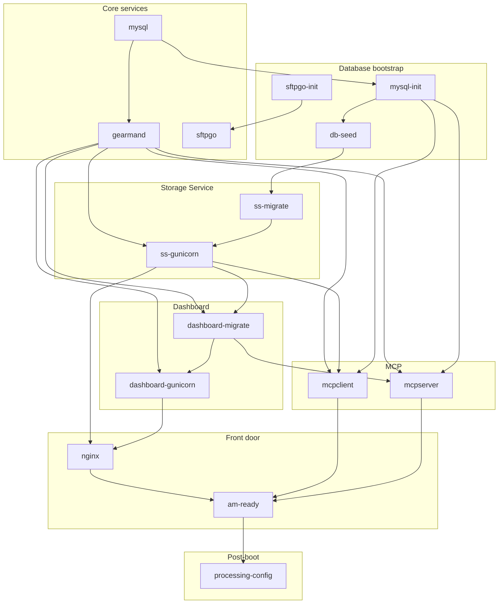

# ambox

This folder contains a monolithic image recipe using s6-overlay to run
Archivematica and its dependencies in a single container. Elasticsearch indexing
and virus scanning are not included.

## Building and running

Build and run the image locally:

  make run

Publishing is not wired in CI yet. To build and push a multi-arch image:

  make buildx-publish

## Usage

Nginx is the front door for the monolith image and exposes two entrypoints:

- `:64080` → Archivematica Dashboard
- `:64081` → Archivematica Storage Service

Additionally, SFTPGo runs an SFTP service on port `64022`. The default SFTP user
is `archivematica` with password `12345`. Use this service to upload your
transfer packages.

### Uploading a transfer via SFTP from the terminal

Connect from your host (macOS/Linux) using OpenSSH `sftp` client:

    # When prompted, enter the password "12345".
    sftp -P 64022 archivematica@localhost

Useful interactive commands once connected:

    pwd
    put -r /path/to/transfer

## Service graph

This is a dependency DAG as defined in `hack/box/s6-rc.d/*/dependencies`. Arrows
point from prerequisite → dependent.

Dependency list

| Service | Depends on |
|---|---|
| `mysql` | (none) |
| `sftpgo-init` | (none) |
| `sftpgo` | `sftpgo-init` |
| `mysql-init` | `mysql` |
| `db-seed` | `mysql-init` |
| `gearmand` | `mysql` |
| `ss-migrate` | `db-seed` |
| `ss-gunicorn` | `ss-migrate`, `gearmand` |
| `dashboard-migrate` | `ss-gunicorn`, `gearmand` |
| `dashboard-gunicorn` | `dashboard-migrate`, `gearmand` |
| `mcpserver` | `mysql-init`, `gearmand`, `dashboard-migrate` |
| `mcpclient` | `mysql-init`, `gearmand`, `ss-gunicorn` |
| `nginx` | `dashboard-gunicorn`, `ss-gunicorn` |
| `am-ready` | `mcpserver`, `mcpclient`, `nginx` |
| `processing-config` | `am-ready` |

