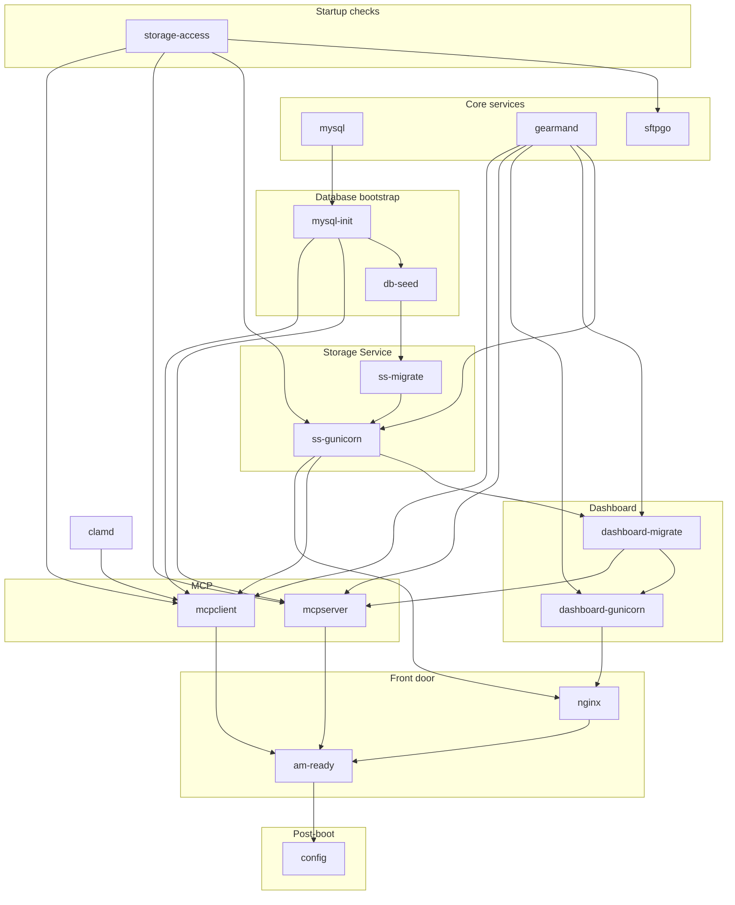
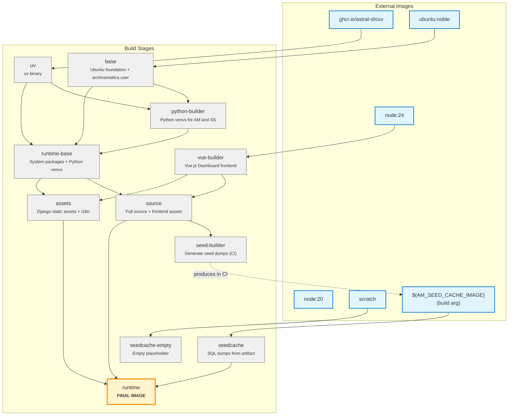

# ambox

## Contents

- [Quick start](#quick-start)
- [Usage](#usage)
  - [Long-running container example](#long-running-container-example)
- [Transfer sources and storage locations](#transfer-sources-and-storage-locations)
  - [Add material to the transfer source](#add-material-to-the-transfer-source)
  - [Mount Docker-managed volumes](#mount-docker-managed-volumes)
  - [Mount host or shared storage](#mount-host-or-shared-storage)
  - [Storage access checks](#storage-access-checks)
  - [Persistence and backup limits](#persistence-and-backup-limits)
- [Configuration schema](#configuration-schema)
- [How it works](#how-it-works)
  - [Current limitations](#current-limitations)
- [Development](#development)
  - [Runtime service dependencies](#runtime-service-dependencies)
  - [Dependency list](#dependency-list)
- [Dockerfile build stages](#dockerfile-build-stages)

The goal of **ambox** is a one-liner style deployment for local testing and
development (or lightweight use cases), where Archivematica runs as a single,
self-contained Linux container environment. It also provides some
configurability via its [config file], letting you customize processing
configuration details and more.

There are potential improvements still to do, such as more configurability,
integration with remote storage services, and similar enhancements. A full
list of ideas is maintained in the [wiki].

[config file]: #configuration-schema
[wiki]: https://github.com/sevein/ambox/wiki

> [!WARNING]
> ambox is intended primarily for local testing, development, and lightweight
> use. It does not currently provide a documented and tested way to persist,
> back up, restore, and upgrade all Archivematica state. Storage mounts retain
> files, but not the workflow state and Storage Service records in MySQL. See
> [persistence and backup limits](#persistence-and-backup-limits).
>
> The published image runs application services as UID/GID `1000:1000`, and its
> bundled SFTP account uses the default password `12345`. Review the
> [current limitations](#current-limitations) before exposing ambox to a network
> or storing material that must be retained.

## Quick start

Run the image and publish the dashboard on port `8080`:

    docker run --rm -p 8080:64080 ghcr.io/sevein/ambox:latest

Then open <http://localhost:8080/> in your browser. You're ready to go!

## Usage

Nginx is the front door for the monolith image and exposes two entrypoints:

- `:64080` → Archivematica Dashboard
- `:64081` → Archivematica Storage Service

Additionally, SFTPGo runs an SFTP service on port `64022`. The default SFTP user
is `archivematica` with password `12345`. Use this service to add material for
transfer to the default transfer source location.

### Long-running container example

> [!WARNING]
> When publishing ports, make sure your host firewall rules actually apply to
> Docker-forwarded traffic, and prefer binding to `127.0.0.1` unless you intend
> to expose the service.

To run the container as a long-lived service with some resource limits and
log rotation, use the following `docker run` command:

```
docker run \
  # Run as a long-lived service
  --detach \
  # Stable container name
  --name ambox \
  # Restart on crash or daemon restart
  --restart unless-stopped \
  # Expose the Dashboard
  --publish 127.0.0.1:64080:64080 \
  # Expose the Storage Service
  --publish 127.0.0.1:64081:64081 \
  # Expose the SFTP service
  --publish 127.0.0.1:64022:64022 \
  # Limit memory
  --memory 8g \
  # Limit CPU
  --cpus 2.0 \
  # Rotate logs to avoid disk exhaustion
  --log-opt max-size=10m \
  # Keep a limited number of log files
  --log-opt max-file=5 \
    ghcr.io/sevein/ambox:test
```

Now with this setup, you can perform a variety of operations, e.g.:

```
docker ps -a --filter name=ambox   # View the container status.
docker logs ambox                  # View the container logs.
docker stop ambox                  # Stop the container.
docker start ambox                 # Start the container.
docker restart ambox               # Restart the container.
docker exec ambox ss -lntup        # View listening services inside the container.
docker exec ambox ps -ef --forest  # View the process tree inside the container.
docker rm ambox                    # Remove the container (only when stopped).
```

## Transfer sources and storage locations

Mount the default transfer source and storage locations when digital objects
and packages must be available outside the container writable layer. Bind and
NFS mounts give host or shared-storage tools direct access. Docker-managed
volumes keep the files independent of a particular container without exposing
a normal host path.

These locations support distinct stages of the Archivematica workflow:

| Location | Container path | Purpose |
| --- | --- | --- |
| Transfer source location | `/home` | Contains digital objects and other material that can be selected for transfer. The transfer process turns selected material into a Submission Information Package (SIP). |
| SFTP upload directory | `/home/archivematica/transfers` | Writable directory within the default transfer source location that SFTPGo makes available over SFTP. |
| AIP storage location | `/var/archivematica/sharedDirectory/www/AIPsStore` | Default archival storage location for Archival Information Packages (AIPs). The default transfer backlog is stored beneath `transferBacklog/`. |
| DIP storage location | `/var/archivematica/sharedDirectory/www/DIPsStore` | Default storage location for Dissemination Information Packages (DIPs), which contain access copies. DIPs may instead be uploaded to an access system or generated later from an AIP. |

Storage Service tracks stored AIPs and DIPs. Host tools may read or back up the
mounted files, but use Archivematica or Storage Service operations to manage
stored packages. In particular, deleting an AIP directly from the filesystem
rather than through Storage Service leaves inconsistent records.

### Add material to the transfer source

A host or shared-filesystem tool can copy digital objects and other material to
a mounted transfer source. A remote user can instead upload the material
through SFTPGo. Both methods make it available in the same transfer source
location; neither starts the transfer process. After the complete directory is
present, select it in the Dashboard Transfer tab and start the transfer, or
submit it through the API.

SFTPGo makes each file visible in the transfer source only after the file
finishes uploading. Upload every file in the transfer directory before
starting the transfer.

Connect from a macOS or Linux host with OpenSSH:

    # When prompted, enter the password "12345".
    sftp -P 64022 archivematica@localhost

Useful interactive commands once connected:

    pwd
    put -r /path/to/transfer

A mount replacing all of `/home` must provide an accessible
`archivematica/transfers` directory so SFTPGo can start. Mount only
`/home/archivematica/transfers` when the SFTP upload directory is the only part
of the transfer source that needs to be mounted.

### Mount Docker-managed volumes

Docker-managed volumes are the simplest way to keep material for transfer and
stored AIPs and DIPs outside a particular container. Fresh volumes inherit the
ownership prepared in the image:

```shell
docker volume create ambox-transfers
docker volume create ambox-aips
docker volume create ambox-dips

docker run --name ambox \
  --publish 127.0.0.1:64080:64080 \
  --publish 127.0.0.1:64081:64081 \
  --publish 127.0.0.1:64022:64022 \
  --mount \
    type=volume,source=ambox-transfers,target=/home/archivematica/transfers \
  --mount \
    type=volume,source=ambox-aips,target=/var/archivematica/sharedDirectory/www/AIPsStore \
  --mount \
    type=volume,source=ambox-dips,target=/var/archivematica/sharedDirectory/www/DIPsStore \
  ghcr.io/sevein/ambox:latest
```

The DIP volume is optional when the processing configuration does not create or
store DIPs.

### Mount host or shared storage

Create host directories before starting the container and grant UID/GID
`1000:1000` access. The same identity must be allowed by ACLs or export rules
when the source paths are on shared or NFS storage. Using `--mount` makes Docker
reject a missing source path instead of silently creating one as root:

```shell
sudo install -d -o 1000 -g 1000 -m 0770 \
  /srv/ambox/transfers \
  /srv/ambox/aips \
  /srv/ambox/dips

docker run --name ambox \
  --publish 127.0.0.1:64080:64080 \
  --publish 127.0.0.1:64081:64081 \
  --publish 127.0.0.1:64022:64022 \
  --mount \
    type=bind,source=/srv/ambox/transfers,target=/home/archivematica/transfers \
  --mount \
    type=bind,source=/srv/ambox/aips,target=/var/archivematica/sharedDirectory/www/AIPsStore \
  --mount \
    type=bind,source=/srv/ambox/dips,target=/var/archivematica/sharedDirectory/www/DIPsStore \
  ghcr.io/sevein/ambox:latest
```

### Storage access checks

The image runs Archivematica, Storage Service, and SFTPGo as the
`archivematica` account with numeric UID/GID `1000:1000`. The `storage-access`
s6 oneshot checks the effective permissions of the default transfer source and
AIP and DIP storage locations after runtime mounts are attached and before
dependent services start. It reports numeric ownership and mode when access is
insufficient.

The check does not mount storage or change ownership. Existing content must be
readable and traversable by UID/GID `1000:1000`, and directories used for
uploads or to store AIPs and DIPs must also be writable. Running the container
with `--user` or `--group-add` does not replace these filesystem permissions.

### Persistence and backup limits

These mounts retain files only while the Docker volume or host storage remains
available. They do not provide a complete Archivematica backup or make a
recreated container recover the previous system state. Workflow state and the
Storage Service records for stored packages remain in MySQL under
`/var/lib/mysql`.

ambox does not yet document or test an upgrade-safe procedure for persisting,
backing up, and restoring its databases together with the mounted files.
Preserve those components separately. The mounts alone provide file retention,
not container-replacement recovery.

## Configuration schema

At boot, ambox reads a config document from `/etc/ambox/config.yaml`, falling
back to the bundled default in [`config/ambox.yaml`](config/ambox.yaml).
The document can populate processing configurations and optional SFTPGo
settings. The JSON Schema is in [`config/schema.json`] and the full reference
guide is in [`config/README.md`]. You can override the config path with
`AMBOX_CONFIG_FILE`.

Example config that extends the bundled defaults, adds an automated override,
and defines a full "demo" configuration:

```yaml
version: v1
processing:
  configs:
    - name: automated
      extends: automated
      config:
        virus_scanning: false
    - name: demo
      extends: default
      config:
        virus_scanning: false
        bind_pids: true
```

To pin a static SFTP host key, provide the path to a private key file that is
readable by the `archivematica` user inside the container. The file must exist
at container start, or the SFTP service will fail to boot.

```yaml
version: v1
sftpgo:
  host_key: /etc/ambox/sftpgo_host_key
```

[`config/ambox.yaml`]: config/ambox.yaml
[`config/schema.json`]: config/schema.json
[`config/README.md`]: config/README.md

## How it works

This image uses the s6-overlay init system to supervise all core Archivematica
services inside a single container. Each service (database, dashboard, storage,
etc.) is managed as an s6 service, with dependencies and startup order defined
in `s6-rc.d`.

[s6-overlay]: https://github.com/just-containers/s6-overlay

### Current limitations

Compared to the standard, officially supported deployment, ambox prioritizes
simplicity and portability. Its current limitations are:

- MySQL data remains in the container writable layer by default. ambox does not
  yet provide a documented and tested, upgrade-safe database persistence,
  backup, or restore procedure. See
  [persistence and backup limits](#persistence-and-backup-limits).
- The documented mount setup and end-to-end verification cover the bundled SFTP
  upload directory and default AIP and DIP storage locations. They do not cover
  non-default and remote Storage Service locations.
- The published image runs application services as UID/GID `1000:1000` and does
  not remap that identity at startup. Linux bind and NFS mounts must grant that
  identity access through ownership or ACLs.
- The bundled SFTP account uses the default password `12345`. Network access,
  credentials, and other production security controls require additional
  hardening.
- Not all ecosystem services are included (e.g. Elasticsearch indexing is
  intentionally omitted).
- Scaling and swapping components independently is harder than in a
  multi-container deployment.

The [wiki] tracks possible future enhancements; this list describes the
user-visible limitations confirmed in this repository.

## Development

Build a local seed cache image, then build and run the image locally:

    make seed-cache-local
    make run

The local `Makefile` defaults to `SEED_CACHE_IMAGE=ambox-build-cache-local`, so
`make seed-cache-local`, `make build`, and `make run` use the same seed cache
repo automatically. `make seed-cache-local` first tries to reuse a matching
remote seed cache tag and falls back to building the seed locally if none
exists. Re-run it after migration changes.

The bundled `hack/box/Makefile` mounts `test/ambox.yaml` and the SFTP test
keys under `test/` to simplify local development. Adjust those mounts if you
want different config or key paths.

Run `make verify` to build the image and process a bundled sample transfer into
an AIP and a DIP. The test starts ambox with fresh volumes mounted at the SFTP
upload directory and default AIP and DIP storage locations, uploads the sample
through SFTP, and checks that the stored AIP and DIP are readable from their
mounted locations. The pytest-bdd scenario also checks that jobs and tasks were
created and uses Playwright with Chromium to verify the transfer, virus scan,
and ingest results in Dashboard.
`make verify` installs the matching Chromium build automatically. Set
`AMBOX_SKIP_BUILD=1` to verify an existing `IMAGE:TAG`. On CI failures, browser
traces and screenshots, recent API responses, and container logs are uploaded
as artifacts. Pull requests run this end-to-end test in CI. Releases test the
amd64 candidate digest before publishing the version and `latest` manifests.

The release workflow defaults to a notes-only preview. It uses Copilot to
summarize the upstream Archivematica and ambox commit ranges, falling back to
deterministic commit lists when Copilot is unavailable. The generated Markdown
is shown in the job summary and uploaded as a workflow artifact. Previewing
does not build or publish images, push a tag, or create a GitHub Release:

    gh workflow run release.yml -f version=1.0.14

To compare generated notes with an existing release, preview its version. The
workflow automatically uses the matching existing tag as its target:

    gh workflow run release.yml -f version=1.0.13

The optional `target` input can preview a different historical tag or commit.

After reviewing a preview, run the workflow with publishing enabled to build
and test the images, publish the manifests, push the tag, and create the
GitHub Release:

    gh workflow run release.yml -f version=1.0.14 -f publish=true

### Runtime service dependencies

This is the service dependency graph bundled in the container image, as defined
in `hack/box/s6-rc.d/*/dependencies`. Arrows point from prerequisite →
dependent.



### Dependency list

| Service | Depends on |
|---|---|
| `mysql` | (none) |
| `storage-access` | (none) |
| `sftpgo` | `storage-access` |
| `mysql-init` | `mysql` |
| `db-seed` | `mysql-init` |
| `gearmand` | (none) |
| `ss-migrate` | `db-seed` |
| `ss-gunicorn` | `ss-migrate`, `gearmand`, `storage-access` |
| `dashboard-migrate` | `ss-gunicorn`, `gearmand` |
| `dashboard-gunicorn` | `dashboard-migrate`, `gearmand` |
| `mcpserver` | `mysql-init`, `gearmand`, `dashboard-migrate`, `storage-access` |
| `mcpclient` | `mysql-init`, `gearmand`, `ss-gunicorn`, `clamd`, `storage-access` |
| `nginx` | `dashboard-gunicorn`, `ss-gunicorn` |
| `am-ready` | `mcpserver`, `mcpclient`, `nginx` |
| `config` | `am-ready` |

## Dockerfile build stages

The `Dockerfile` uses a multi-stage build to construct the final runtime image.
Understanding these stages helps when making changes or debugging build issues.

**Build stages:**

| Stage | Depends on | Purpose |
|---|---|---|
| `uv` | ghcr.io/astral-sh/uv | Provides uv binary for Python management |
| `base` | ubuntu:noble | Foundation with locale setup and archivematica user |
| `python-builder` | base, uv | Builds Python virtual environments for AM and SS |
| `vue-builder` | node:24 | Compiles Dashboard Vue.js frontend |
| `seedcache-empty` | scratch | Empty placeholder stage (dev/testing only) |
| `seedcache` | ${AM_SEED_CACHE_IMAGE} | Provides SQL database dumps from external artifact |
| `runtime-base` | base, uv, python-builder | Runtime with all system packages and Python venvs |
| `source` | runtime-base, vue-builder | Adds full source code and compiled frontend assets |
| `assets` | runtime-base, vue-builder | Generates Django static assets and translations |
| `seed-builder` | source | Generates seed dumps (used in CI to create seed cache) |
| `runtime` | source, seedcache, assets | **Final stage** - combines everything for distribution |



The `runtime` stage is what gets tagged and published.

**Note:** The `seed-builder` stage doesn't directly connect to the Dockerfile's
`seedcache` stage. Instead, it's used in CI to generate the seed cache artifact
that gets pushed to GHCR. This artifact is then referenced via the
`AM_SEED_CACHE_IMAGE` build argument in subsequent builds. The dashed line shows
this conceptual relationship.
